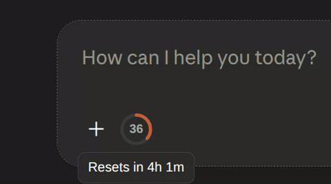
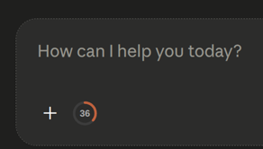
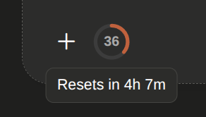
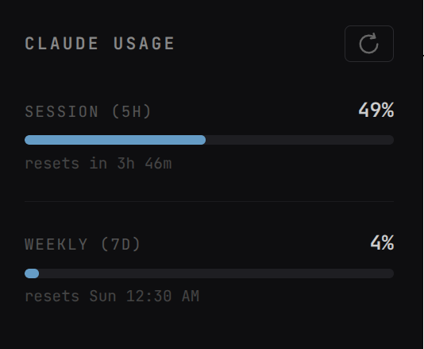

# Claude Usage Ring

A lightweight Chrome extension that shows your Claude.ai **5-hour usage limit** as a small progress ring right next to the chat input — and auto-refreshes after every response.

## Features

- **Usage ring** — shows what percentage of your 5-hour Claude.ai limit you've used, right in the chat UI
- **Reset timer** — hover over the ring to see how long until your limit resets
- **Auto-refresh** — automatically re-checks your usage right after each response finishes
- **Manual refresh** — click the ring anytime to force an update
- **Weekly limit view** — click the extension icon to see your weekly usage limit in the popup
- **Uses your existing session** — no login, API key, or extra setup needed; it reads usage the same way claude.ai itself does

## Screenshots:

##### Usage ring in the chat input

##### Hover tooltip (reset time)

##### Extension popup

## Installation

1. Download or clone this repository.
2. Open Chrome and go to `chrome://extensions`.
3. Enable **Developer mode** (toggle in the top-right corner).
4. Click **Load unpacked** and select this extension's folder.
5. Open [claude.ai](https://claude.ai) — the usage ring should appear near the chat input box.

## How it works

- On page load, the extension fetches your current usage from Claude.ai's internal usage API using your existing browser session (`credentials: 'include'`) — the same data the website itself uses.
- A small ring icon is injected next to the "Add files, connectors, and more" button, showing your usage percentage.
- A `MutationObserver` watches for Claude's **Stop response** button. When it disappears (response finished), the extension automatically re-fetches your usage.
- Your organization ID is cached locally to avoid an extra API call on every refresh.

## Disclaimer

This extension relies on an **undocumented, internal Claude.ai API endpoint** — the same one the claude.ai web app uses internally to display usage. It is:

- Not part of Anthropic's official public API
- Not affiliated with or endorsed by Anthropic
- Subject to breaking if Anthropic changes their internal API

Use at your own discretion.

## License

MIT

## Uploaded June 14 2026 
